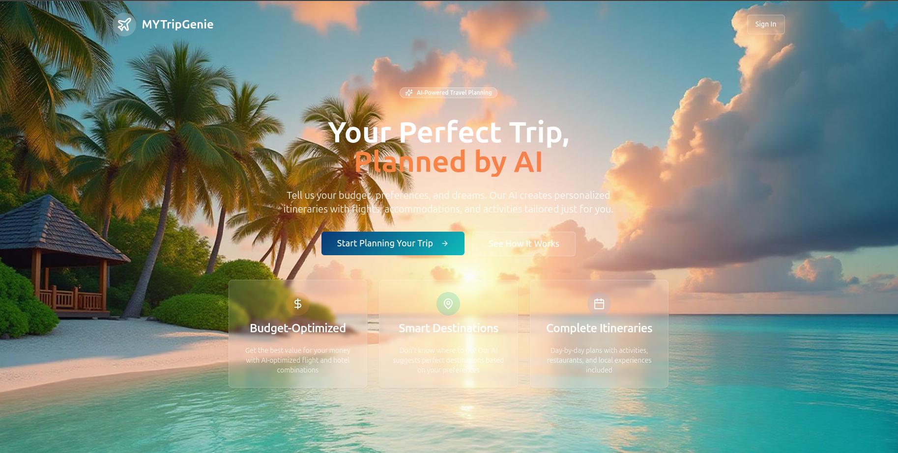

# My Trip Genie - Budget Wizard

## Getting Started

To get this project up and running locally, follow these steps:

### Prerequisites

- Node.js & npm installed - [install with nvm](https://github.com/nvm-sh/nvm#installing-and-updating)

### Setup Instructions

```sh
# Step 1: Clone the repository
git clone <YOUR_GIT_URL>

# Step 2: Navigate to the project directory
cd mytrip-budget-wizard

# Step 3: Install the necessary dependencies
npm i

# Step 4: Start the development server with auto-reloading and an instant preview
npm run dev
```

## Technologies Used

This project is built with:

- Vite
- TypeScript
- React
- shadcn-ui
- Tailwind CSS


## About the App - My Trip Genie

My Trip Genie whips up its magic to transform your travel dreams into reality! 🧞‍♂️✨

**Smart Trip Planning Made Simple**

Gone are the days of endless research and overwhelming choices. My Trip Genie is an intelligent trip planning application that creates personalized, day-by-day itineraries tailored to your specific needs and budget constraints.

**How It Works:**
- 💰 **Budget-Conscious Planning**: Input your desired budget and group size
- 🗺️ **Location Intelligence**: Tell us your dream destination  
- 🎯 **Comprehensive Itineraries**: Get detailed daily plans including:
  - 🏨 Accommodation recommendations
  - 🚗 Transportation options
  - 🎭 Activities and attractions
  - 🍽️ Dining suggestions

**Perfect For:**
- Solo adventurers to large group travels
- Weekend getaways to extended vacations
- Budget backpackers to luxury travelers
- First-time visitors to experienced explorers

**The Magic Behind the Scenes:**
My Trip Genie leverages intelligent algorithms to optimize your travel experience, ensuring every dollar is well-spent and every moment is memorable. No more decision fatigue – just pack your bags and let the genie handle the rest!
